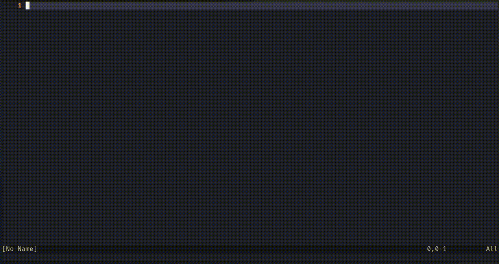

# neochat.nvim

GPTChat in neovim



## Please Be Cautious

This plugin is currently in its early developmental stages and is only suitable for my personal usage preferences. 
It is advisable that you are aware of the implications before attempting to utilize it. 
Additionally, I may not respond to any issues that may arise.

## Prerequistes

- neovim 0.8+
- Python3.8+
- [nui.nvim](https://github.com/MunifTanjim/nui.nvim)
- Env: `OPENAI_API_KEY`

## Installation

Using `lazy.nvim`

```lua
{
    'Xuyuanp/neochat.nvim',
    build = function()
        vim.fn.system({ 'pip', 'install', '-U', 'openai', })
    end,
    dependencies = {
        'MunifTanjim/nui.nvim',
    },
    config = function()
        require('neochat').setup({
            -- no config yet
        })
    end,
}
```
